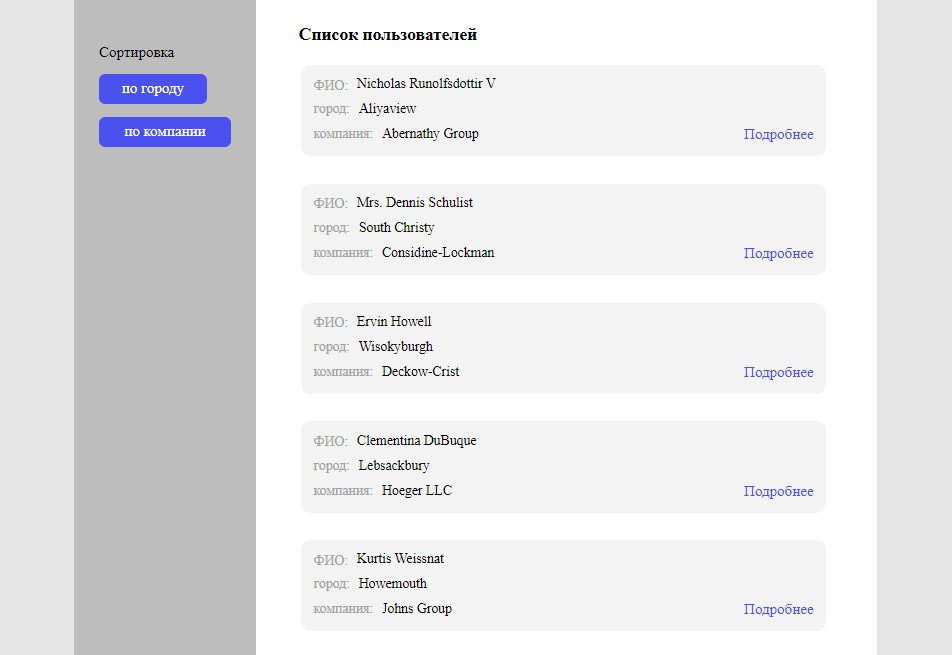
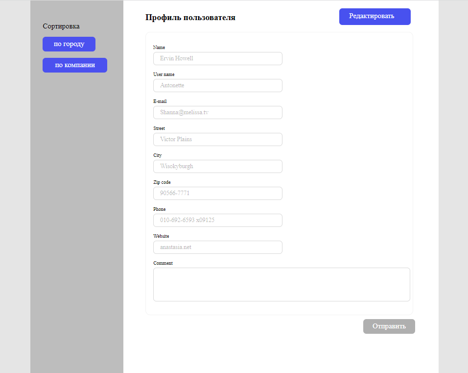

# Страница со списком пользователей
### Сверстаны две страницы: "Список пользователей" и "Профиль пользователя"
## Список пользователей:
1. Выводятся 10 пользователей. Данные взяты  с [https://jsonplaceholder.typicode.com/users](http://jsonplaceholder.typicode.com/users)
2. Пока идет загрузка списка пользователей, отображается индикатор загрузки
3. Выводятся на карточку:
 - name
 - address.city
 - company.name
4. Кнопка "Подробнее" ведет на "Профиль пользователя"
5. Реализована фильтрация списка по городу и названию компании в алфавитном порядке

## Профиль пользователя:
1. Выводятся в профиле:
- name
- username
- email
- address.street
- address.city
- address.zipcode
- phone
- website
2. Все поля формы, кроме Comment, предзаполнены из [https://jsonplaceholder.typicode.com/users](http://jsonplaceholder.typicode.com/users)
3. Реализована кнопка "Редактировать", изначально поля readonly, после нажатия на кнопку поля можно редактировать
4. Реализована валидация на клиенте
5. Все поля формы, кроме поля Comment, обязательны для заполнения
6. Из данных формы при отправке формируется JSON и выводится в консоль

### При создании SPA использовались технологии и инструменты:
* React
* Redux
* React-Redux
* Redux-Thunk
* TypeScript
* Препроцессор SCSS
* Webpack
* Библиотека Lodash
### Просмотр итогового вида SPA доступен по ссылке: [https://yuliyabaskakova3012.github.io/list-of-users/](https://yuliyabaskakova3012.github.io/list-of-users/)
